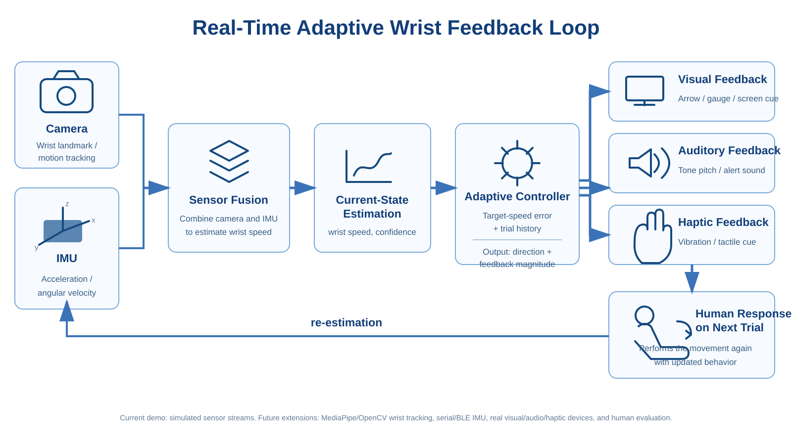

# Real-Time Adaptive Wrist Feedback Loop

  

Flow:

IMU / camera wrist measurement
→ current-state estimation
→ target-speed error + trial history
→ adaptive feedback magnitude
→ visual / auditory / haptic feedback
→ next trial
→ re-estimation

The included demo simulates camera and IMU streams, sensor fusion, an adaptive controller,
and the human response. Hardware adapters can later replace the simulated measurements.

Run:
    python main.py
